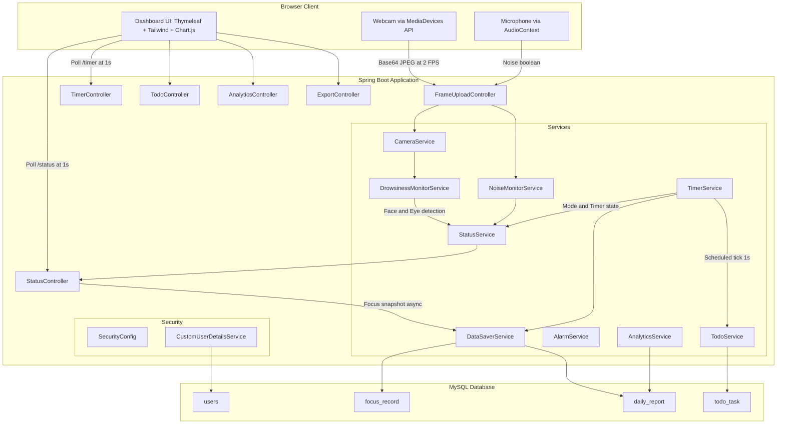
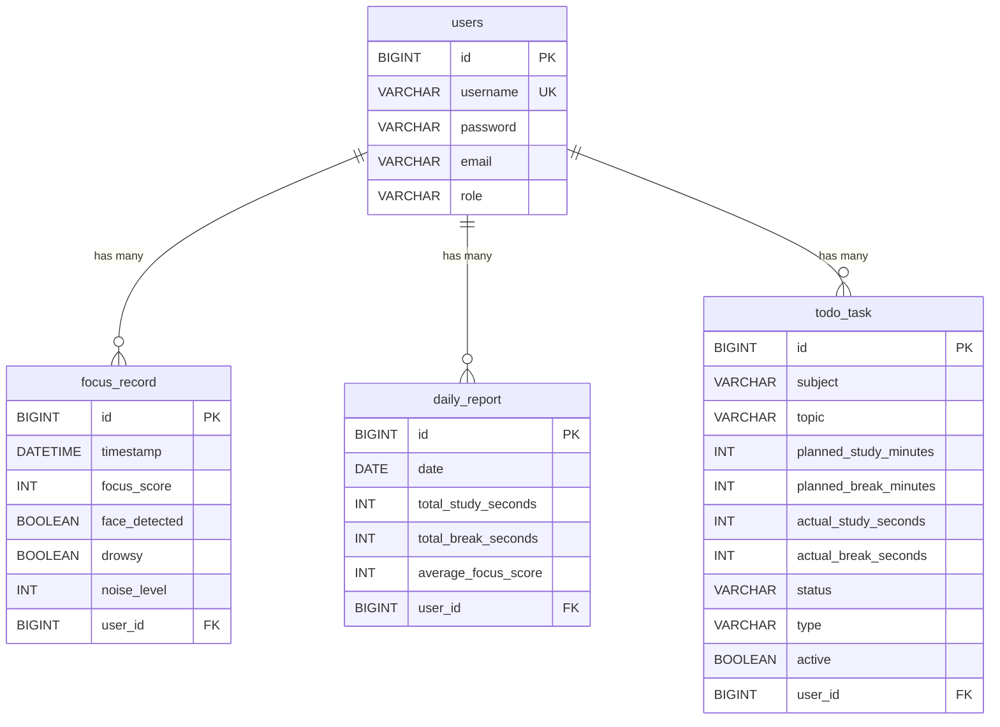

# Smart Study Monitor

> A full-stack study productivity platform built with Spring Boot and OpenCV that monitors student focus in real time through webcam-based face and eye detection, tracks study sessions with configurable timers, computes a live focus score, and delivers AI-driven adaptive break recommendations — all persisted to MySQL and exportable as CSV/Excel reports.


---

## Table of Contents

- [Project Overview](#project-overview)
- [Problem Statement](#problem-statement)
- [Solution](#solution)
- [Key Features](#key-features)
- [Technology Stack](#technology-stack)
- [System Architecture](#system-architecture)
- [Application Workflow](#application-workflow)
- [Project Structure](#project-structure)
- [Core Components](#core-components)
- [API Documentation](#api-documentation)
- [Database Design](#database-design)
- [Computer Vision Pipeline](#computer-vision-pipeline)
- [AI Adaptive Break System](#ai-adaptive-break-system)
- [Multithreading & Scheduling](#multithreading--scheduling)
- [Installation & Setup](#installation--setup)
- [Running the Application](#running-the-application)
- [Docker Setup](#docker-setup)
- [Screenshots](#screenshots)
- [Testing](#testing)
- [Performance & Scalability](#performance--scalability)
- [Security](#security)
- [Challenges & Engineering Decisions](#challenges--engineering-decisions)
- [Future Improvements](#future-improvements)
- [Project Metrics](#project-metrics)
- [Learning Outcomes](#learning-outcomes)
- [Resume Highlights](#resume-highlights)

---

## Project Overview

Smart Study Monitor is a full-stack web application that automates the process of tracking and improving student focus during study sessions. Unlike passive study timers, this system actively monitors the user through their webcam, detects face presence and eye state using computer vision, evaluates ambient noise levels via the browser microphone, computes a composite focus score, and uses that telemetry to trigger intelligent break recommendations when fatigue is detected.

The application is designed for students who want data-driven insight into their study habits rather than relying on subjective self-assessment. It combines backend engineering (Spring Boot, JPA, Spring Security), computer vision (OpenCV with Haar cascade classifiers), real-time browser media APIs, scheduled background services, and a polished glassmorphism dashboard into a cohesive platform.

**What sets this apart from a basic study timer:**

- Real-time computer vision (face detection + drowsiness detection) running on the server
- Composite focus scoring derived from face presence, eye state, noise level, and session mode
- AI-driven adaptive break suggestions based on drowsiness accumulation and focus trend analysis
- Per-user multi-tenant architecture with full Spring Security authentication
- Browser-to-server frame streaming (webcam frames sent as Base64 over REST)
- Persistent daily reports with CSV and Excel export
- Multi-user concurrent session support via `ConcurrentHashMap`-based state management

---

## Problem Statement

Students routinely struggle with:

- **Inconsistent focus** — Prolonged study sessions often lead to diminishing returns without the student being aware of declining attention.
- **No objective feedback** — Traditional methods offer no data on when and how focus degrades over time.
- **Manual session tracking** — Pen-and-paper or app-based timers require active management and lack integration with actual focus metrics.
- **Undetected drowsiness** — A student may continue studying while drowsy, resulting in ineffective learning without any alert mechanism.
- **Noise distractions** — Environmental noise impacts concentration, but students rarely quantify or address it systematically.
- **Lack of historical analytics** — Without aggregated data, it is difficult to identify patterns in study efficiency across days and weeks.

---

## Solution

Smart Study Monitor addresses these problems through a closed-loop system:

```
User --> Webcam/Mic Capture (Browser) --> Frame Upload (REST API) --> OpenCV Analysis (Server)
  |                                                                          |
  v                                                                          v
Todo Task Management <-- Timer Service (Scheduled) --> Focus Score Computation
  |                                                          |
  v                                                          v
Session Persistence (MySQL) <-- Data Saver Service --> Adaptive Break Engine
  |                                                          |
  v                                                          v
Analytics Dashboard <-- Daily Report Aggregation --> CSV/Excel Export
```

1. **Capture**: The browser captures webcam frames and microphone audio levels using the `MediaDevices` API.
2. **Stream**: Frames are Base64-encoded and POSTed to the server at ~2 FPS alongside noise status.
3. **Analyze**: The `DrowsinessMonitorService` runs a background thread that pulls the latest frame and applies Haar cascade classifiers for face and eye detection.
4. **Score**: The `StatusService` computes a weighted focus score (face presence: 40, alertness: 30, quiet environment: 20, active study mode: 10).
5. **Adapt**: The AI adaptive break engine tracks drowsiness duration and focus trend history per user, triggering break recommendations when thresholds are exceeded.
6. **Persist**: The `DataSaverService` asynchronously writes `FocusRecord` snapshots and updates `DailyReport` aggregates to MySQL.
7. **Report**: The analytics dashboard renders weekly/monthly trends via Chart.js, and data is exportable as CSV or Excel.

---

## Key Features

### Study Session Management
- Configurable study/break timers (Pomodoro-style)
- Todo task system with subject, topic, planned durations
- Automatic study-to-break-to-completion cycle transitions
- Task status tracking (PENDING, IN_PROGRESS, PAUSED, COMPLETED)
- Actual vs. planned time comparison per task

### Real-Time Focus Monitoring
- Webcam-based face detection (Haar cascade frontal face classifier)
- Eye-state detection for drowsiness assessment (Haar cascade eye classifier)
- Browser microphone-based ambient noise level monitoring
- Live focus score computation (0-100 scale)
- Visual status overlay on camera feed (FOCUSED / DROWSY / NO FACE)

### AI Adaptive Break Recommendations
- Drowsiness accumulation tracking with configurable thresholds
- Focus trend analysis over rolling 60-sample windows
- Context-aware break suggestions with 10-minute cooldown
- User-actionable toast notifications (accept or dismiss)
- Automatic timer mode switching on break acceptance

### Productivity Analytics
- Daily aggregated reports (study time, break time, average focus score)
- Weekly and monthly trend charts (Chart.js line graphs)
- Today's performance summary cards
- Session history with per-task progress tracking

### Data Export
- CSV export of daily reports (last 30 days)
- Excel (.xlsx) export with formatted headers and auto-sized columns
- Per-user scoped exports (authenticated)

### Authentication & Multi-Tenancy
- User registration with BCrypt password hashing
- Form-based login with Spring Security 6
- Per-user data isolation across all entities
- CSRF protection with cookie-based token repository
- Role-based access control

### Audio Alerts
- Context-specific alarm sounds (no face, drowsiness, break end)
- Automatic alert suppression during break periods
- Server-side audio playback via `javax.sound.sampled`

---

## Technology Stack

| Layer | Technology | Version | Purpose |
|-------|-----------|---------|---------|
| **Language** | Java | 17 | Core application language |
| **Framework** | Spring Boot | 3.2.1 | Application framework, DI, auto-configuration |
| **Web** | Spring MVC | 6.x | REST controllers, Thymeleaf view resolution |
| **Security** | Spring Security | 6.x | Authentication, authorization, CSRF protection |
| **ORM** | Spring Data JPA / Hibernate | 6.x | Entity mapping, repository abstraction |
| **Database** | MySQL | 8.0 | Persistent storage (dev: local, prod: cloud) |
| **Template Engine** | Thymeleaf | 3.x | Server-side HTML rendering |
| **Computer Vision** | OpenCV (openpnp) | 4.9.0 | Face detection, eye detection, frame processing |
| **CSV Export** | OpenCSV | 5.8 | CSV report generation |
| **Excel Export** | Apache POI | 5.2.5 | XLSX report generation with formatting |
| **Validation** | Jakarta Bean Validation | 3.x | Input validation annotations |
| **Utility** | Lombok | — | Boilerplate reduction (optional) |
| **Frontend** | Thymeleaf + Tailwind CSS + Chart.js | — | Dashboard UI, analytics charts |
| **Build** | Maven | 3.8+ | Dependency management, build lifecycle |
| **Containerization** | Docker | Multi-stage | Production deployment |
| **Deployment** | Railway | — | Cloud hosting (PaaS) |

---

## System Architecture



**Component Responsibilities:**

| Component | Role |
|-----------|------|
| `CameraService` | Thread-safe frame buffer — stores the latest webcam frame received from the browser |
| `DrowsinessMonitorService` | Background daemon thread running face/eye detection at ~3 FPS using Haar cascades |
| `NoiseMonitorService` | Receives noise status updates from the browser's AudioContext analysis |
| `StatusService` | Aggregates all sensor data into a `StatusInfo` DTO with focus score and adaptive break logic |
| `TimerService` | `@Scheduled` 1-second tick managing per-user study/break/idle state machines |
| `TodoService` | CRUD operations for study tasks with status lifecycle management |
| `DataSaverService` | `@Async` persistence of focus snapshots and daily report updates |
| `AlarmService` | Server-side audio alert playback with clip management |
| `AnalyticsService` | Date-range queries for weekly/monthly analytics aggregation |
| `SecurityConfig` | Spring Security filter chain — form login, CSRF, role-based authorization |

---

## Application Workflow

1. **User registers** an account (username, email, BCrypt-hashed password) and logs in.
2. **Post-login**, the user lands on the **Home Portal** and navigates to the **Live Dashboard**.
3. The browser requests **webcam and microphone access** via `navigator.mediaDevices.getUserMedia()`.
4. A client-side interval captures frames at 2 FPS, encodes them as Base64 JPEG, and POSTs them alongside noise status to `/api/camera/frame`.
5. The **`CameraService`** stores the latest frame; the **`DrowsinessMonitorService`** (daemon thread) pulls it every 300ms and runs Haar cascade detection.
6. The user **creates a Todo task** (subject, topic, planned study/break minutes) and clicks **Start** — this activates the `TimerService` for that user.
7. The **`TimerService`** ticks every second, counting down the study timer. Study and break seconds are accumulated and flushed to the database every 60 seconds.
8. The dashboard **polls `/status` every second**, receiving the composite focus score, face/drowsy flags, noise status, timer state, and any adaptive break suggestions.
9. If the AI adaptive break engine detects 15+ seconds of cumulative drowsiness or a focus average below 45 over the last 30+ samples, a **break recommendation toast** appears.
10. When the study timer expires, the system automatically switches to break mode; when the break timer expires, the todo is marked completed.
11. The **`DataSaverService`** asynchronously persists `FocusRecord` snapshots (every 60s) and updates the `DailyReport` with running averages.
12. The user views **Analytics** (weekly/monthly charts) on the History page and can **export** their data as CSV or Excel.

---

## Project Structure

```
smart-study-monitor/
├── src/
│   ├── main/
│   │   ├── java/com/studyfocus/
│   │   │   ├── SmartStudyMonitorApplication.java   # Entry point, @EnableScheduling
│   │   │   ├── config/
│   │   │   │   ├── SecurityConfig.java             # Spring Security filter chain, BCrypt, CSRF
│   │   │   │   └── AsyncConfig.java                # @EnableAsync configuration
│   │   │   ├── controller/
│   │   │   │   ├── AuthController.java             # Login/Register (MVC)
│   │   │   │   ├── PageController.java             # View routing
│   │   │   │   ├── TimerController.java            # REST: timer start/stop/switch/status
│   │   │   │   ├── StatusController.java           # REST: real-time status + periodic persistence
│   │   │   │   ├── TodoController.java             # REST: CRUD for study tasks
│   │   │   │   ├── AnalyticsController.java        # REST: weekly/monthly/today analytics
│   │   │   │   ├── ExportController.java           # REST: CSV and Excel export
│   │   │   │   ├── FrameUploadController.java      # REST: webcam frame + noise ingestion
│   │   │   │   ├── VideoController.java            # MJPEG stream endpoint
│   │   │   │   └── ProgressController.java         # REST: progress log
│   │   │   ├── entity/
│   │   │   │   ├── User.java                       # JPA entity — users table
│   │   │   │   ├── FocusRecord.java                # JPA entity — per-minute focus snapshots
│   │   │   │   ├── DailyReport.java                # JPA entity — daily aggregated metrics
│   │   │   │   └── TodoTask.java                   # JPA entity — study tasks
│   │   │   ├── model/
│   │   │   │   ├── StatusInfo.java                 # DTO: real-time status payload
│   │   │   │   ├── SessionMode.java                # Enum: STUDY, BREAK, IDLE
│   │   │   │   ├── TodoStatus.java                 # Enum: PENDING, IN_PROGRESS, COMPLETED, PAUSED
│   │   │   │   ├── TodoType.java                   # Enum: DAILY, WEEKLY
│   │   │   │   └── Progress.java                   # Model: state timeline
│   │   │   ├── repository/
│   │   │   │   ├── UserRepository.java             # JPA: findByUsername, findByEmail
│   │   │   │   ├── FocusRecordRepository.java      # JPA: ordered focus records by user
│   │   │   │   ├── DailyReportRepository.java      # JPA: date-range queries per user
│   │   │   │   └── TodoRepository.java             # JPA: active/user-scoped todo queries
│   │   │   └── service/
│   │   │       ├── TimerService.java               # @Scheduled tick, per-user state machine
│   │   │       ├── StatusService.java              # Focus score computation, adaptive break AI
│   │   │       ├── DrowsinessMonitorService.java   # Background CV thread, Haar cascade detection
│   │   │       ├── CameraService.java              # Thread-safe frame buffer
│   │   │       ├── NoiseMonitorService.java        # Noise status receiver
│   │   │       ├── AlarmService.java               # Audio alert playback
│   │   │       ├── TodoService.java                # Task lifecycle management
│   │   │       ├── DataSaverService.java           # @Async persistence layer
│   │   │       ├── AnalyticsService.java           # Date-range analytics queries
│   │   │       ├── ProgressService.java            # Timeline tracking
│   │   │       └── CustomUserDetailsService.java   # Spring Security UserDetailsService
│   │   └── resources/
│   │       ├── application.properties              # Profile activation, port binding
│   │       ├── application-dev.properties          # Local MySQL config
│   │       ├── application-prod.properties         # Environment variable-driven config
│   │       ├── haarcascade/
│   │       │   ├── haarcascade_frontalface_default.xml
│   │       │   └── haarcascade_eye.xml
│   │       ├── templates/
│   │       │   ├── index.html                      # Landing page
│   │       │   ├── login.html                      # Login form
│   │       │   ├── register.html                   # Registration form
│   │       │   ├── home.html                       # Post-login portal
│   │       │   ├── dashboard.html                  # Live monitoring dashboard
│   │       │   └── history.html                    # Analytics and export page
│   │       └── *.wav                               # Alarm audio files (4 clips)
│   └── test/                                       # Test source root
├── Dockerfile                                      # Multi-stage build
├── .dockerignore
├── .gitignore
├── pom.xml                                         # Maven POM with all dependencies
└── README.md
```

---

## Core Components

### Controllers (10 classes)

| Controller | Type | Responsibility |
|-----------|------|----------------|
| `AuthController` | `@Controller` | Renders login/register views; handles registration POST with duplicate-username validation |
| `PageController` | `@Controller` | View routing for index, home, dashboard, and history pages |
| `TimerController` | `@RestController` | REST endpoints for timer start, stop, switch-to-break, and current state |
| `StatusController` | `@RestController` | Returns real-time `StatusInfo` JSON; triggers periodic focus snapshot persistence (60s debounce) |
| `TodoController` | `@RestController` | Full CRUD for `TodoTask` entities; integrates with `TimerService` on task start |
| `AnalyticsController` | `@RestController` | Weekly, monthly, and today's analytics from `DailyReport` aggregates |
| `ExportController` | `@RestController` | CSV and Excel download endpoints scoped to authenticated user's last 30 days |
| `FrameUploadController` | `@RestController` | Receives Base64-encoded webcam frames and noise status from the browser |
| `VideoController` | `@RestController` | MJPEG streaming endpoint for server-side video feed |
| `ProgressController` | `@RestController` | Returns timeline progress records |

### Services (11 classes)

| Service | Key Mechanism | Interaction |
|---------|--------------|-------------|
| `TimerService` | `@Scheduled(fixedRate=1000)` — ticks every second across all active user timers | Writes to `TodoService` and `DataSaverService` on pending-second flush |
| `StatusService` | Computes weighted focus score; implements AI adaptive break logic with per-user tracking | Reads from `DrowsinessMonitorService`, `NoiseMonitorService`, `TimerService` |
| `DrowsinessMonitorService` | `@PostConstruct` daemon thread — runs OpenCV detection every 300ms | Reads from `CameraService`; exposes volatile booleans |
| `CameraService` | `synchronized` frame buffer with `volatile Mat` | Written by `FrameUploadController`; read by `DrowsinessMonitorService` |
| `DataSaverService` | `@Async` + `@Transactional` — non-blocking database writes | Persists `FocusRecord`, updates `DailyReport` moving averages |
| `TodoService` | `@Transactional` — task lifecycle with active-task exclusivity enforcement | Operates on `TodoRepository` |
| `AlarmService` | `javax.sound.sampled.Clip` management with preloaded `.wav` files | Triggered by `StatusService` alarm logic |
| `CustomUserDetailsService` | `UserDetailsService` implementation — supports login by username or email | Used by Spring Security `DaoAuthenticationProvider` |

---

## API Documentation

### Timer APIs

| Method | Endpoint | Parameters | Description |
|--------|----------|------------|-------------|
| `POST` | `/timer/start` | `study` (int), `brk` (int) | Start a study timer with specified durations in minutes |
| `POST` | `/timer/stop` | — | Stop the current timer and flush accumulated seconds |
| `POST` | `/timer/switch-to-break` | — | Force switch from study to break mode |
| `GET` | `/timer` | — | Get current timer state (mode, remaining seconds) |

### Status API

| Method | Endpoint | Description |
|--------|----------|-------------|
| `GET` | `/status` | Returns `StatusInfo` JSON: focus score, face/drowsy flags, noise, timer mode, break suggestion |

### Todo APIs

| Method | Endpoint | Description |
|--------|----------|-------------|
| `POST` | `/todo` | Create a new todo task (JSON body) |
| `GET` | `/todo` | List all todos for the authenticated user |
| `POST` | `/todo/{id}/start` | Start a specific todo and activate its timer |
| `POST` | `/todo/{id}/complete` | Mark a todo as completed |
| `DELETE` | `/todo/{id}` | Delete a todo |

### Analytics APIs

| Method | Endpoint | Description |
|--------|----------|-------------|
| `GET` | `/api/analytics/weekly` | Last 7 days of daily reports |
| `GET` | `/api/analytics/monthly` | Last 30 days of daily reports |
| `GET` | `/api/analytics/today` | Today's aggregated report |

### Export APIs

| Method | Endpoint | Description |
|--------|----------|-------------|
| `GET` | `/export/csv` | Download CSV of last 30 days |
| `GET` | `/export/excel` | Download XLSX of last 30 days |

### Camera API

| Method | Endpoint | Description |
|--------|----------|-------------|
| `POST` | `/api/camera/frame` | Upload Base64 webcam frame and noise status |

### Video Stream

| Method | Endpoint | Description |
|--------|----------|-------------|
| `GET` | `/video` | MJPEG stream of processed frames at ~10 FPS |

---

## Database Design



- **`users`** — User accounts with BCrypt-hashed passwords and role assignments.
- **`focus_record`** — Per-minute focus snapshots capturing the state of all monitoring signals at a point in time.
- **`daily_report`** — Aggregated daily metrics (total study/break seconds, running average focus score). One record per user per day.
- **`todo_task`** — Study task definitions with planned vs. actual duration tracking and status lifecycle.

All entities use `@ManyToOne(fetch = FetchType.LAZY)` relationships to `User`, ensuring per-user data isolation.

---

## Computer Vision Pipeline

The `DrowsinessMonitorService` implements a real-time computer vision pipeline using OpenCV's Java bindings:

```
Camera Frame (Mat)
    |
    v
Grayscale Conversion (Imgproc.cvtColor -> COLOR_BGR2GRAY)
    |
    v
Histogram Equalization (Imgproc.equalizeHist)
    |
    v
Face Detection (CascadeClassifier -> haarcascade_frontalface_default.xml)
    |  Parameters: scaleFactor=1.1, minNeighbors=5, minSize=80x80
    |
    |-- No faces -> Increment noFaceFrames counter
    |     If noFaceFrames >= 8 (~2.5s) -> faceDetected = false
    |
    +-- Face found -> Select largest face -> Extract eye region (top 45% of face)
        |
        v
    Eye Detection (CascadeClassifier -> haarcascade_eye.xml)
        |  Parameters: scaleFactor=1.1, minNeighbors=5, minSize=25x15
        |
        |-- No eyes detected -> Increment closedEyeFrames counter
        |     If closedEyeFrames >= 6 (~2s) -> drowsy = true
        |
        +-- Eyes detected -> closedEyeFrames = 0, drowsy = false
```

**Key Design Decisions:**

- **Classpath resource extraction**: Haar cascade XML files are bundled in the JAR and extracted to temp files at startup (via `ClassPathResource` and `Files.copy`), enabling deployment in containerized environments where filesystem paths are unpredictable.
- **Frame-counter thresholds**: Rather than reacting to single-frame detections, the system uses frame counters (`NO_FACE_THRESHOLD = 8`, `DROWSY_THRESHOLD = 6`) to filter noise and prevent false alarms.
- **Daemon thread**: The detection loop runs on a daemon thread with a 300ms sleep interval (~3.3 FPS analysis rate), decoupled from the frame capture rate.
- **Volatile flags**: `faceDetected` and `drowsy` are declared `volatile` to ensure visibility across the detection thread and the HTTP request threads reading them.

---

## AI Adaptive Break System

The `StatusService` implements a rule-based adaptive break recommendation engine that monitors user state and suggests breaks when signs of fatigue are detected.

### How It Works

The system tracks two independent fatigue signals per user:

**1. Drowsiness Accumulation**
- When the user is drowsy during a STUDY session, a `drowsySeconds` counter increments.
- When not drowsy, the counter slowly decrements (by 1).
- When the counter reaches **15 seconds**, a break is recommended.
- The counter resets after a suggestion is made.

**2. Focus Trend Analysis**
- Each status poll appends the current focus score to a rolling history (max 60 samples).
- When 30+ samples are collected, the average is computed.
- If the average falls **below 45**, a break is recommended.
- The history is cleared after a suggestion.

**Cooldown Mechanism**: After any break suggestion (accepted or dismissed), a **10-minute cooldown** prevents repeated notifications. This cooldown is enforced both server-side (`userLastSuggestionTime` map) and client-side (JavaScript timeout).

### Focus Score Composition

| Signal | Weight | Condition for Points |
|--------|--------|---------------------|
| Face detected | 40 | Webcam detects a face |
| Not drowsy | 30 | Eyes are open (no drowsiness) |
| Quiet environment | 20 | Noise level below threshold |
| Active study mode | 10 | Timer is in STUDY mode |

| Score Range | Label |
|-------------|-------|
| 80-100 | Excellent Focus |
| 60-79 | Good Focus |
| 40-59 | Low Focus |
| 0-39 | Very Low Focus |

---

## Multithreading & Scheduling

The application employs multiple concurrency mechanisms:

| Mechanism | Where | Purpose |
|-----------|-------|---------|
| `@EnableScheduling` + `@Scheduled(fixedRate=1000)` | `TimerService.tick()` | Per-second countdown across all active user timers |
| `@EnableAsync` + `@Async` | `DataSaverService` | Non-blocking database writes for focus snapshots and daily reports |
| Daemon `Thread` | `DrowsinessMonitorService.start()` | Background CV processing loop (300ms interval) |
| `ConcurrentHashMap` | `TimerService.userTimers`, `StatusService` tracking maps | Thread-safe per-user state storage |
| `synchronized` methods | `TimerService`, `CameraService`, `AlarmService` | Mutual exclusion on shared mutable state |
| `volatile` fields | `DrowsinessMonitorService`, `CameraService`, `NoiseMonitorService` | Cross-thread visibility guarantees |

This architecture ensures that expensive operations (database writes, CV processing) do not block the HTTP request cycle, maintaining responsive status polling.

---

## Installation & Setup

### Prerequisites

| Requirement | Version | Notes |
|------------|---------|-------|
| Java JDK | 17+ | Required |
| Maven | 3.8+ | Build tool |
| MySQL | 8.0+ | Database (local for dev) |
| OpenCV | 4.9.0 | Native libraries for local development |
| Git | 2.x+ | Version control |
| Docker | 20.10+ | Optional, for containerized deployment |

### Clone Repository

```bash
git clone <ADD_GITHUB_URL>
cd smart-study-monitor
```

### Database Setup

Create the MySQL database:

```sql
CREATE DATABASE smart_study_monitor;
```

### Configuration

#### Development Profile (`application-dev.properties`)

```properties
spring.datasource.url=jdbc:mysql://localhost:3306/smart_study_monitor
spring.datasource.username=your_db_username
spring.datasource.password=your_db_password
spring.datasource.driver-class-name=com.mysql.cj.jdbc.Driver

spring.jpa.hibernate.ddl-auto=update
spring.jpa.show-sql=true
spring.jpa.properties.hibernate.dialect=org.hibernate.dialect.MySQL8Dialect
```

#### Production Profile (`application-prod.properties`)

Uses environment variables:

```
SPRING_DATASOURCE_URL=jdbc:mysql://your-cloud-host:3306/your_db
SPRING_DATASOURCE_USERNAME=your_username
SPRING_DATASOURCE_PASSWORD=your_password
```

#### OpenCV Native Libraries (Local Development)

For local execution, OpenCV native libraries must be installed and referenced in `SmartStudyMonitorApplication.java`. Update the paths to match your OpenCV installation:

```java
System.load("C:/opencv/build/java/x64/opencv_java490.dll");
System.load("C:/opencv/build/x64/vc16/bin/opencv_videoio_ffmpeg490_64.dll");
```

> **Note**: When deployed via Docker, OpenCV Java bindings are loaded through the Maven dependency (`org.openpnp:opencv:4.9.0-0`) and native libs are installed via `apt-get`.

---

## Running the Application

### Local Development

```bash
mvn spring-boot:run
```

Or with explicit profile:

```bash
mvn spring-boot:run -Dspring-boot.run.profiles=dev
```

Access the application at: `http://localhost:8080`

### Build JAR

```bash
mvn clean package -DskipTests
java -jar target/smart-study-monitor-1.0.jar
```

---

## Docker Setup

The project includes a **multi-stage Dockerfile**:

**Stage 1 — Build:**
- Base: `maven:3.8.5-openjdk-17-slim`
- Caches dependencies with `mvn dependency:go-offline`
- Builds the JAR with `mvn clean package -DskipTests`

**Stage 2 — Run:**
- Base: `openjdk:17-slim`
- Installs OpenCV native dependencies (`libgl1-mesa-glx`, `libglib2.0-0`)
- Runs with configurable Spring profile via `SPRING_PROFILES_ACTIVE` environment variable

### Build and Run

```bash
docker build -t smart-study-monitor .

docker run -p 8080:8080 \
  -e SPRING_PROFILES_ACTIVE=prod \
  -e SPRING_DATASOURCE_URL=jdbc:mysql://host:3306/db \
  -e SPRING_DATASOURCE_USERNAME=user \
  -e SPRING_DATASOURCE_PASSWORD=pass \
  smart-study-monitor
```

### Railway Deployment

The project is configured for Railway deployment. Set the following environment variables in your Railway service:

```
SPRING_PROFILES_ACTIVE=prod
SPRING_DATASOURCE_URL=<railway-mysql-url>
SPRING_DATASOURCE_USERNAME=<railway-mysql-user>
SPRING_DATASOURCE_PASSWORD=<railway-mysql-password>
PORT=8080
```

---

## Screenshots

> Screenshots of the running application can be added to a `/docs/screenshots/` directory.

| Page | Description |
|------|-------------|
| `<ADD_SCREENSHOT>` | Landing page with glassmorphism design |
| `<ADD_SCREENSHOT>` | Login and registration forms |
| `<ADD_SCREENSHOT>` | Home portal with navigation cards |
| `<ADD_SCREENSHOT>` | Live dashboard with camera feed, focus score, timer, and todo list |
| `<ADD_SCREENSHOT>` | AI adaptive break suggestion toast |
| `<ADD_SCREENSHOT>` | Analytics page with weekly/monthly charts |

---

## Testing

### Current Testing Approach

- **Manual functional testing** — All features have been manually validated across the full user workflow (registration, login, dashboard, monitoring, analytics, export).
- **Spring Boot Test** and **Spring Security Test** dependencies are included in the POM for unit and integration testing.
- **API testing** — REST endpoints have been validated using the dashboard's JavaScript client and direct HTTP requests.

### Areas Covered

- User registration and login flow
- Timer start/stop/transition lifecycle
- Todo CRUD operations and status transitions
- Focus score computation accuracy across different input states
- CSV and Excel export output format validation
- Adaptive break suggestion trigger conditions
- Multi-user concurrent session isolation

> Automated test suites are planned as a future improvement.

---

## Performance & Scalability

- **Non-blocking persistence**: All database writes from monitoring loops are `@Async`, preventing I/O blocking on the status polling path.
- **Debounced snapshots**: Focus records are persisted at most once per 60 seconds per user, not on every poll.
- **Timer batch flush**: Study/break seconds are accumulated in memory and flushed to the database every 60 seconds, reducing write frequency.
- **Frame processing isolation**: OpenCV detection runs on a separate daemon thread with its own timing, independent of HTTP request throughput.
- **ConcurrentHashMap state**: Per-user timer states are stored in a `ConcurrentHashMap`, supporting concurrent access without global locks.
- **Lazy-loaded relationships**: JPA entities use `FetchType.LAZY` for `@ManyToOne` relationships, avoiding unnecessary joins.
- **Compressed frame transfer**: Webcam frames are JPEG-compressed at 60% quality before Base64 encoding, reducing payload size.

---

## Security

| Practice | Implementation |
|----------|---------------|
| **Password hashing** | BCrypt via `BCryptPasswordEncoder` |
| **Authentication** | Spring Security 6 form-based login with `DaoAuthenticationProvider` |
| **Authorization** | All endpoints except landing, login, register, and static resources require authentication |
| **CSRF protection** | Cookie-based CSRF token repository (`CookieCsrfTokenRepository.withHttpOnlyFalse()`) |
| **Data isolation** | All database queries are scoped to the authenticated user |
| **Production secrets** | Environment variable-based configuration for database credentials in production |
| **Login flexibility** | `CustomUserDetailsService` supports login by username or email |

---

## Challenges & Engineering Decisions

### 1. OpenCV Integration in a Spring Boot JAR
**Problem**: OpenCV requires native libraries (`.dll` / `.so`) that cannot be loaded from inside a JAR file.  
**Solution**: Haar cascade XML files are extracted from the classpath to temporary files at runtime using `ClassPathResource` and `Files.copy()`. For the Docker deployment, native libs are installed via `apt-get` in the Dockerfile.

### 2. Browser-to-Server Frame Streaming
**Problem**: The server needs webcam frames for CV processing, but the webcam is in the user's browser.  
**Solution**: Implemented a client-side frame capture pipeline using Canvas API (`drawImage` to `toDataURL`), Base64-encoding frames, and POSTing them to a REST endpoint. The server decodes them back into OpenCV `Mat` objects via `Imgcodecs.imdecode()`.

### 3. Real-Time State Without WebSockets
**Problem**: The dashboard needs near-real-time updates for timer, focus score, and status overlays.  
**Solution**: Client-side polling at 1-second intervals on `/status` and `/timer` endpoints. This approach was chosen for simplicity and compatibility with Spring MVC, avoiding the complexity of WebSocket session management.

### 4. Multi-User Timer Concurrency
**Problem**: Multiple users can run simultaneous study sessions, each with independent timers.  
**Solution**: Used `ConcurrentHashMap<Long, TimerState>` keyed by user ID, with a single `@Scheduled` tick method iterating all active timers. `synchronized` methods protect timer state transitions.

### 5. False Positive Alarm Suppression
**Problem**: Single-frame face/eye detection failures caused rapid alarm toggling.  
**Solution**: Frame-counter thresholds (`NO_FACE_THRESHOLD = 8`, `DROWSY_THRESHOLD = 6`) require sustained detection failures before triggering state changes.

### 6. Preventing Database Write Storms
**Problem**: With 1-second status polling, naive persistence would generate overwhelming database traffic.  
**Solution**: Focus snapshots are debounced to 60-second intervals. Timer seconds are accumulated in-memory and batch-flushed. All persistence is `@Async`.

---

## Future Improvements

- **Deep learning-based attention detection** — Replace Haar cascades with a CNN/DNN model for more accurate drowsiness and distraction detection.
- **WebSocket real-time communication** — Replace HTTP polling with WebSocket channels for lower-latency status updates.
- **Automated test suite** — Implement JUnit 5 + Mockito unit tests and Spring Boot integration tests.
- **Mobile-responsive PWA** — Optimize the dashboard for mobile browsers and add PWA capabilities.
- **Spaced repetition integration** — Incorporate scientifically-backed study scheduling algorithms.
- **Study group rooms** — Real-time collaborative study sessions with shared focus accountability.
- **Advanced analytics** — Heatmaps, focus-by-subject breakdowns, and personalized study time recommendations.
- **Email notifications** — Scheduled daily/weekly performance digests via Spring Mail.
- **Redis caching** — Cache analytics queries and session state for improved scalability.
- **OAuth2 / SSO** — Social login support for Google and GitHub.

---

## Project Metrics

| Metric | Value |
|--------|-------|
| Java source files | 32 |
| Java lines of code | ~1,680 |
| HTML template files | 6 |
| HTML/CSS/JS lines | ~1,650 |
| REST API endpoints | 15 |
| JPA entities | 4 |
| Spring services | 11 |
| Controllers | 10 |
| Repositories | 4 |
| Haar cascade models | 2 |
| Audio alert files | 4 |

---

## Learning Outcomes

This project demonstrates proficiency in:

- **Java 17** — Modern language features and LTS platform
- **Spring Boot 3.2** — Auto-configuration, profiles, dependency injection
- **Spring MVC** — REST controllers, Thymeleaf view resolution, content negotiation (JSON, CSV, XLSX, MJPEG)
- **Spring Security 6** — SecurityFilterChain API, form login, BCrypt, CSRF, role-based authorization
- **Spring Data JPA / Hibernate** — Entity mapping, repository abstraction, custom queries, lazy loading, transactional management
- **Concurrency** — `@Scheduled`, `@Async`, `ConcurrentHashMap`, `volatile`, `synchronized`, daemon threads
- **OpenCV (Java)** — Native library loading, Haar cascade classifiers, Mat operations, image encoding/decoding
- **Full-Stack Integration** — Browser MediaDevices API to Base64 streaming to server-side CV to REST polling to dynamic UI
- **Database Design** — Normalized schema, aggregation patterns, date-range queries
- **Docker** — Multi-stage builds, native library installation, environment-variable-driven configuration
- **Cloud Deployment** — Railway PaaS, environment-based Spring profiles
- **Frontend** — Tailwind CSS, Chart.js, glassmorphism design, responsive layout, real-time DOM updates

---

## Resume Highlights

- Engineered a full-stack study monitoring platform using **Spring Boot 3.2, Spring Security 6, JPA/Hibernate, and MySQL**, featuring user authentication, per-user data isolation, configurable study/break timers, and a task management system — deployed via **Docker** on **Railway**.

- Implemented a real-time **computer vision pipeline** using **OpenCV 4.9** with Haar cascade classifiers for face and eye detection, processing browser-streamed webcam frames on the server to compute a composite focus score and detect drowsiness with frame-counter-based threshold filtering.

- Designed an **AI-driven adaptive break recommendation engine** that tracks drowsiness accumulation and focus trend averages per user, triggering context-aware break suggestions with cooldown enforcement — reducing prolonged low-focus study periods.

- Built a **concurrent multi-user architecture** using `@Scheduled` ticking, `@Async` database persistence, `ConcurrentHashMap`-based state management, and daemon threads — supporting simultaneous study sessions with per-second timer resolution and debounced database writes.

---

<p align="center">
  <strong>Smart Study Monitor</strong> — Built with Spring Boot, OpenCV, and engineering discipline.
</p>
